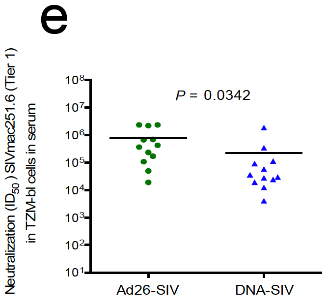

# v43: source code
R code to reproduce figures in [Vaccari M. et al., 2018](https://www.nature.com/articles/s41591-018-0025-7)

## List of figures:
[Fig. S9e](#fig-s9e)  

## Fig. S9e
  
Fig. S9e: [R code [MD]](code/20200418_V43.FigS9e.code.md), [Input file [CSV]](input/20200418_V43.FigS9e.input.csv)  
  
## Supplemental material:

### Microarray analysis
code:  
- preprocessing: [[MD]](code/20160105_V43.preprocessing.code.md)  
  
input:  
- non-normalized·matrix: [[CSV]](input/GA_illumina_expression.v43.matrix_non_norm.csv)  
- arrays/samples annotation: [[CSV]](input/GA_illumina_expression.v43.metadata.csv)  
- features annotation: [[TSV]](input/Illumina_HumanHT12_V4.rheMac3.chip)  
  
output:  
- non-normalized ExpressionSet: [[RDA]](output/v43.esetRaw.RData)  
- quantile normalized ExpressionSet: [[RDA]](output/v43.eset.RData)  
- pre-vaccination-substracted ExpressionSet: [[RDA]](output/v43.esetBaselined.RData)  
- MArrayLM list: [[RDA]](output/v43.fits.RData)
