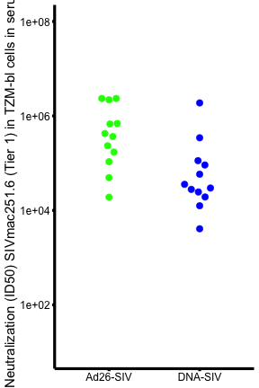

Loading require packages

```r
suppressPackageStartupMessages(library(package = "knitr"))
suppressPackageStartupMessages(library(package = "ggbeeswarm"))
suppressPackageStartupMessages(library(package = "tidyverse"))
```

Set default options/variables

```r
workDir <- dirname(getwd())
opts_chunk$set(tidy = FALSE, fig.path = "../figure/")
options(stringsAsFactors  = FALSE,
	width             = 80,
	readr.num_columns = 0)
```

Read neutralizing antibody data

```r
nabFile <- file.path(workDir,
		     "input/20200418_V43.FigS9e.input.csv")
nabDF <- read_csv(file = nabFile)
```

Plot jitter plot

```r
plotDF <- nabDF %>%
  filter(Vaccine %in% c("Ad26 ALVACSIV/gp120 ALUM", "DNA ALVACSIV/gp120-ALUM")) %>%
  mutate(Vaccine = gsub(pattern = " .+",
			replacement = "-SIV",
			Vaccine),
	 `Montefiori Neutralization Ab Data.ID50 in TZM-bl Cells.Serum Neutralization SIVmac251.6` =
	   gsub(pattern     = ">",
		replacement = "",
		`Montefiori Neutralization Ab Data.ID50 in TZM-bl Cells.Serum Neutralization SIVmac251.6`),
	 `Montefiori Neutralization Ab Data.ID50 in TZM-bl Cells.Serum Neutralization SIVmac251.6` = 
	   as.numeric(`Montefiori Neutralization Ab Data.ID50 in TZM-bl Cells.Serum Neutralization SIVmac251.6`))

ggplot(data = plotDF,
       mapping = aes(x = Vaccine,
		     y = `Montefiori Neutralization Ab Data.ID50 in TZM-bl Cells.Serum Neutralization SIVmac251.6`)) +
     geom_beeswarm(mapping = aes(color = Vaccine), cex = 4, size = 3) +
     scale_y_log10(limits = c(10, 1e8)) +
     scale_colour_manual(values = c("Ad26-SIV" = "green",
				    "DNA-SIV"  = "blue")) +
     labs(x = NULL,
	  y = "Neutralization (ID50) SIVmac251.6 (Tier 1) in TZM-bl cells in serum") +
     theme_minimal() +
     theme(axis.ticks = element_line(size = 1.5),
	   axis.line = element_line(size = 1.5),
	   legend.pos  = "none",
	   axis.title  = element_text(size = 15),
	   axis.text   = element_text(size = 12, color = "black"),
	   panel.grid = element_blank())
```



```r
# c/w a paired test was used in the figure published 
wilcox.test(formula = `Montefiori Neutralization Ab Data.ID50 in TZM-bl Cells.Serum Neutralization SIVmac251.6`~ Vaccine,
	    data   = plotDF,
	    paired = TRUE)
```

```
## 
## 	Wilcoxon signed rank test
## 
## data:  Montefiori Neutralization Ab Data.ID50 in TZM-bl Cells.Serum Neutralization SIVmac251.6 by Vaccine
## V = 66, p-value = 0.03418
## alternative hypothesis: true location shift is not equal to 0
```

```r
# however an unpaired test should have been used 
wilcox.test(formula = `Montefiori Neutralization Ab Data.ID50 in TZM-bl Cells.Serum Neutralization SIVmac251.6`~ Vaccine,
	    data   = plotDF,
	    paired = TRUE)
```

```
## 
## 	Wilcoxon signed rank test
## 
## data:  Montefiori Neutralization Ab Data.ID50 in TZM-bl Cells.Serum Neutralization SIVmac251.6 by Vaccine
## V = 66, p-value = 0.03418
## alternative hypothesis: true location shift is not equal to 0
```

Print session info

```r
sessionInfo()
```

```
## R version 3.6.3 (2020-02-29)
## Platform: x86_64-apple-darwin19.3.0 (64-bit)
## Running under: macOS Catalina 10.15.4
## 
## Matrix products: default
## BLAS/LAPACK: /usr/local/Cellar/openblas/0.3.9/lib/libopenblasp-r0.3.9.dylib
## 
## locale:
## [1] en_US.UTF-8/en_US.UTF-8/en_US.UTF-8/C/en_US.UTF-8/en_US.UTF-8
## 
## attached base packages:
## [1] stats     graphics  grDevices utils     datasets  methods   base     
## 
## other attached packages:
##  [1] forcats_0.5.0    stringr_1.4.0    dplyr_0.8.5      purrr_0.3.3     
##  [5] readr_1.3.1      tidyr_1.0.2      tibble_3.0.0     tidyverse_1.3.0 
##  [9] ggbeeswarm_0.6.0 ggplot2_3.3.0    knitr_1.28      
## 
## loaded via a namespace (and not attached):
##  [1] beeswarm_0.2.3   tidyselect_1.0.0 xfun_0.13        haven_2.2.0     
##  [5] lattice_0.20-41  colorspace_1.4-1 vctrs_0.2.4      generics_0.0.2  
##  [9] rlang_0.4.5      pillar_1.4.3     glue_1.4.0       withr_2.1.2     
## [13] DBI_1.1.0        dbplyr_1.4.2     modelr_0.1.6     readxl_1.3.1    
## [17] lifecycle_0.2.0  munsell_0.5.0    gtable_0.3.0     cellranger_1.1.0
## [21] rvest_0.3.5      evaluate_0.14    vipor_0.4.5      fansi_0.4.1     
## [25] highr_0.8        broom_0.5.5      Rcpp_1.0.4.6     scales_1.1.0    
## [29] backports_1.1.6  jsonlite_1.6.1   farver_2.0.3     fs_1.4.1        
## [33] digest_0.6.25    hms_0.5.3        stringi_1.4.6    grid_3.6.3      
## [37] cli_2.0.2        tools_3.6.3      magrittr_1.5     crayon_1.3.4    
## [41] pkgconfig_2.0.3  ellipsis_0.3.0   xml2_1.2.5       reprex_0.3.0    
## [45] lubridate_1.7.8  rstudioapi_0.11  assertthat_0.2.1 httr_1.4.1      
## [49] R6_2.4.1         nlme_3.1-147     compiler_3.6.3
```
